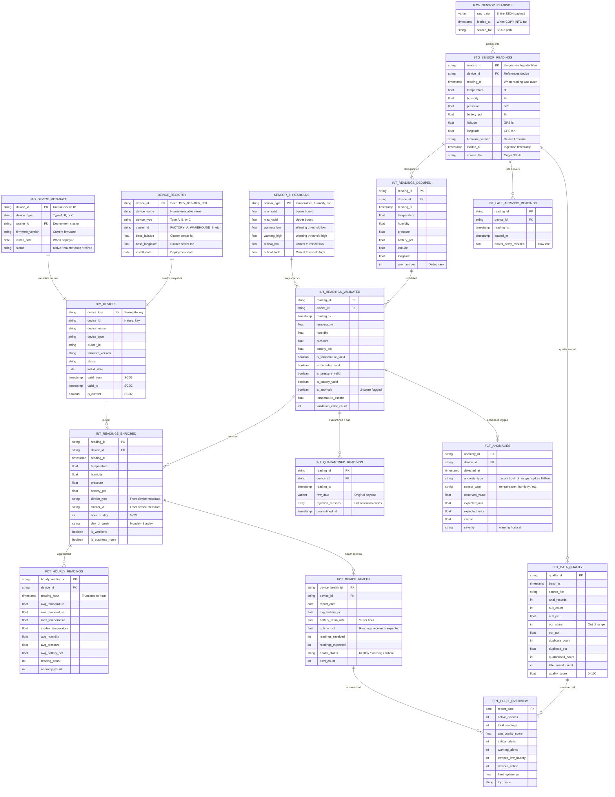
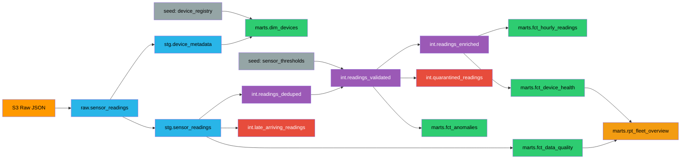

# Data Model — IoT Fleet Monitor Pipeline

## Entity Relationship Diagram

## Data Lineage (DAG)

### Color Legend
- **Orange**: External source (S3)
- **Blue**: Raw / Staging layer
- **Purple**: Intermediate layer
- **Red**: Quarantine / Late arrivals
- **Green**: Mart layer (Iceberg tables)
- **Yellow**: Reporting
- **Gray**: Seeds (reference data)

## Storage Format by Layer

| Layer | Format | Location | Why |
|-------|--------|----------|-----|
| Landing | JSON | S3 `sensor_readings/` | Simple, fast writes from Lambda |
| Raw | VARIANT | Snowflake internal | Preserve original payload exactly |
| Staging–Intermediate | Snowflake tables | Snowflake internal | Fast joins, transformations |
| Marts | Apache Iceberg (Parquet) | S3 `iceberg/iot_pipeline/` | Open format, portable, time travel |

## Key Relationships

- Every **reading** comes from exactly one **device**
- Every **device** belongs to one **cluster**
- **Quarantined readings** reference the original reading but are stored separately
- **Anomalies** are derived from validated readings, one anomaly per (reading, sensor_type) combination
- **Hourly readings** aggregate from enriched readings, one row per (device, hour)
- **Device health** aggregates daily per device
- **Fleet overview** summarizes daily across entire fleet
- **dim_devices** tracks historical changes via SCD Type 2 (firmware updates, status changes)
