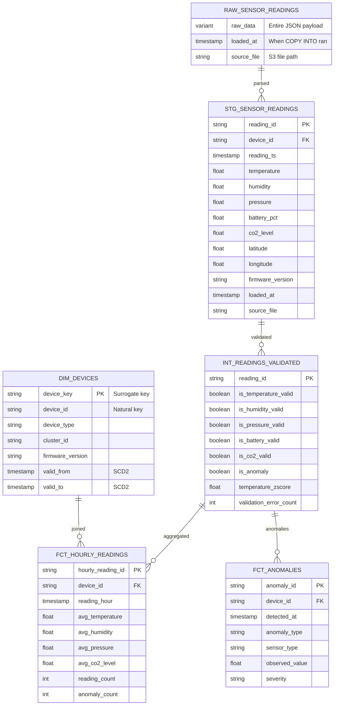
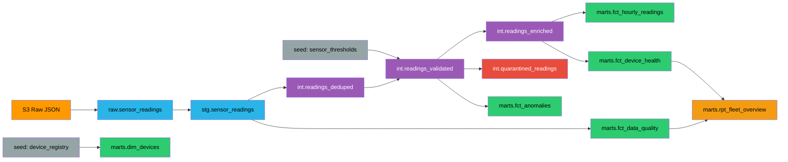

# Project Specification — IoT Fleet Monitor Pipeline

## Domain

An industrial IoT fleet of **50 sensor devices** deployed across 5 geographic clusters (factory floors, warehouses, outdoor stations). Each device reports every **5 minutes**:

| Metric | Unit | Normal Range | Description |
|--------|------|-------------|-------------|
| Temperature | °C | -20 to 60 | Ambient temperature |
| Humidity | % | 10 to 95 | Relative humidity |
| Pressure | hPa | 950 to 1050 | Atmospheric pressure |
| Battery | % | 0 to 100 | Device battery level (slowly draining) |
| CO2 | ppm | 300 to 2000 | CO2 level (firmware >= 2.0.0 only) |
| Latitude/Longitude | ° | varies by cluster | GPS coordinates |

**Daily volume**: 50 devices × 288 readings/day = **14,400 readings/day**

---

## Device Fleet

| Cluster | Location | Devices | Environment |
|---------|----------|---------|-------------|
| FACTORY_A | NYC (40.71, -74.01) | DEV_001–DEV_010 | Indoor, stable temp |
| FACTORY_B | LA (34.05, -118.24) | DEV_011–DEV_020 | Indoor, warm |
| WAREHOUSE_A | Chicago (41.88, -87.63) | DEV_021–DEV_030 | Semi-outdoor, variable |
| WAREHOUSE_B | Houston (29.76, -95.37) | DEV_031–DEV_040 | Semi-outdoor, humid |
| OUTDOOR | Seattle (47.61, -122.33) | DEV_041–DEV_050 | Outdoor, rain/cold |

Each device has: `device_id`, `device_type` (A/B/C), `firmware_version`, `install_date`, `cluster_id`

---

## Data Flow

```
1. Lambda (generate) → 2. S3 (raw JSON) → 3. Snowflake RAW (VARIANT)
                                                    ↓
                                               4. dbt transforms
                                          (staging → intermediate → marts)
                                                    ↓
                                         5. Iceberg tables (Parquet on S3)
                                                    ↓
                                          6. Monitoring & Alerts

                        Airflow orchestrates every step
```

### 1. Generation (Lambda)
Triggered on schedule (EventBridge) or on-demand. Random walk for sensor values. Error injection via profiles (none/normal/high/chaos).

### 2. Landing (S3)
`s3://bucket/sensor_readings/year=YYYY/month=MM/day=DD/hour=HH/batch_{ts}.json`

### 3. Ingestion (Snowflake RAW)
`COPY INTO` from S3 stage → VARIANT column. Snowpipe available for auto-ingest.

### 4. Transformation (dbt)
- **Staging**: Parse VARIANT → typed columns with TRY_CAST
- **Intermediate**: Dedup → Validate (range + z-score) → Enrich → Quarantine → Late arrivals
- **Marts**: dim_devices, dim_clusters, fct_hourly_readings, fct_device_health, fct_anomalies, fct_data_quality, rpt_fleet_overview

### 5. Curated Storage (Iceberg)
Mart tables as Snowflake-managed Iceberg tables. Parquet on S3, queryable by Spark, Trino, DuckDB.

### 6. Monitoring
Quality dashboards, alert rules, row count anomaly detection.

---

## Snowflake Object Model

```
IOT_PIPELINE (database)
├── RAW
│   ├── sensor_readings      — VARIANT, raw JSON
│   └── load_audit_log       — Load metadata
├── STAGING
│   ├── stg_sensor_readings  — Parsed, typed columns
│   └── stg_device_metadata  — Latest metadata per device
├── INTERMEDIATE
│   ├── int_readings_deduped
│   ├── int_readings_validated
│   ├── int_readings_enriched
│   ├── int_quarantined_readings
│   └── int_late_arriving_readings
├── MARTS (Iceberg → Parquet on S3)
│   ├── dim_devices, dim_clusters
│   ├── fct_hourly_readings, fct_device_health, fct_anomalies, fct_data_quality
│   └── rpt_fleet_overview
└── MONITORING
    └── freshness_log
```

**Roles**: IOT_LOADER (write RAW), IOT_TRANSFORMER (read/write all), IOT_READER (read MARTS)
**Warehouse**: IOT_WH — X-Small, auto-suspend 60s

---

## Entity Relationship Diagram



## Data Lineage



**Colors**: Orange=S3, Blue=Raw/Staging, Purple=Intermediate, Red=Quarantine, Green=Marts, Yellow=Reports, Gray=Seeds

## Storage by Layer

| Layer | Format | Location | Why |
|-------|--------|----------|-----|
| Landing | JSON | S3 | Simple, fast writes from Lambda |
| Raw | VARIANT | Snowflake internal | Preserve original payload |
| Staging–Intermediate | Snowflake tables | Snowflake internal | Fast joins |
| Marts | Iceberg (Parquet) | S3 | Open format, portable, time travel |

## Technology Versions

| Technology | Version |
|-----------|---------|
| Python | 3.11 |
| Apache Airflow | 3.1.3 |
| dbt-core + dbt-snowflake | latest |
| Pydantic | v2 |
| sqlfluff + ruff | latest |

## Error Profiles

| Profile | Nulls | Out-of-Range | Duplicates |
|---------|-------|-------------|------------|
| `none` | 0% | 0% | 0% |
| `normal` | 3% | 2% | 5% |
| `high` | 10% | 8% | 15% |
| `chaos` | 25% | 15% | 30% |
